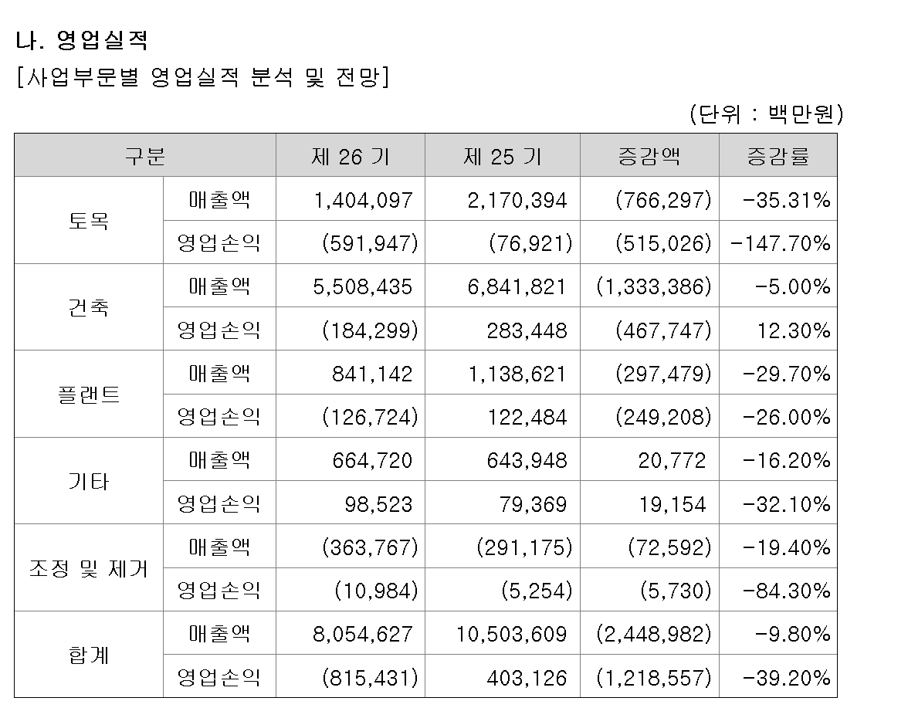
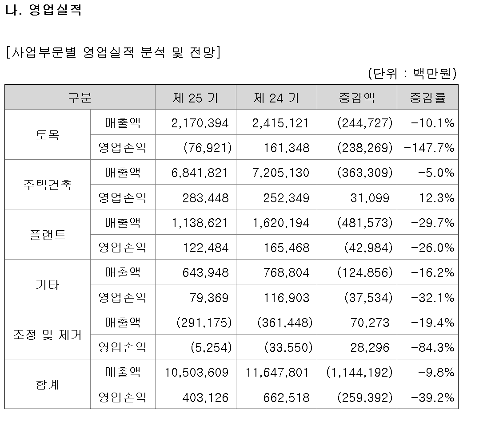
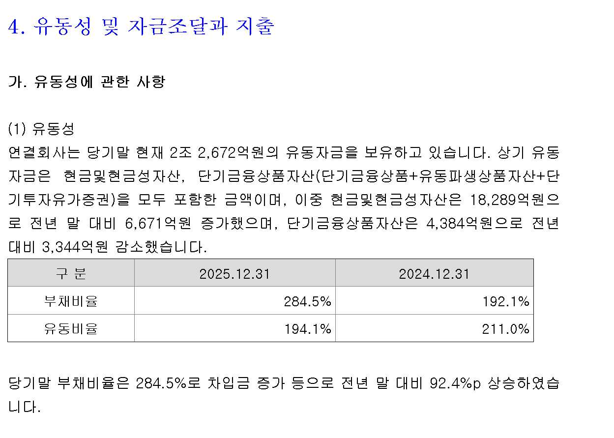
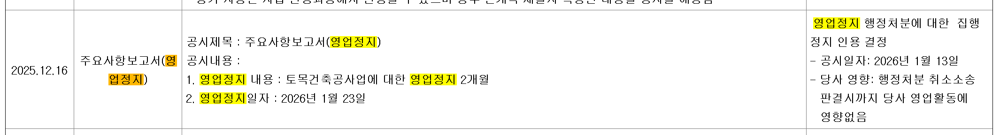
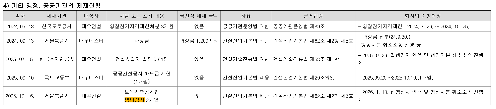
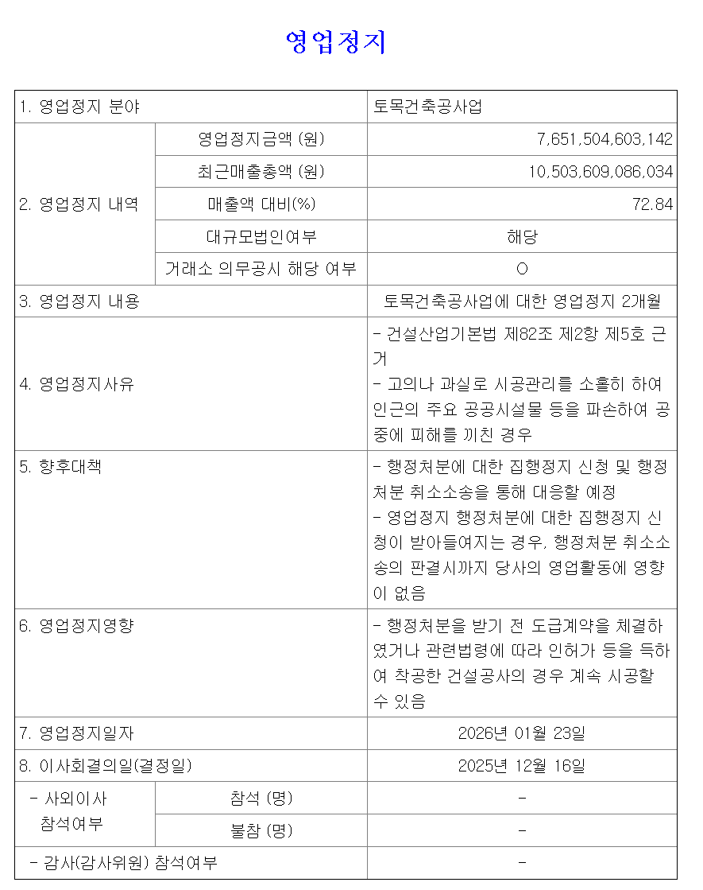
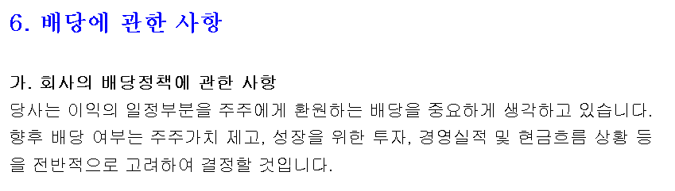
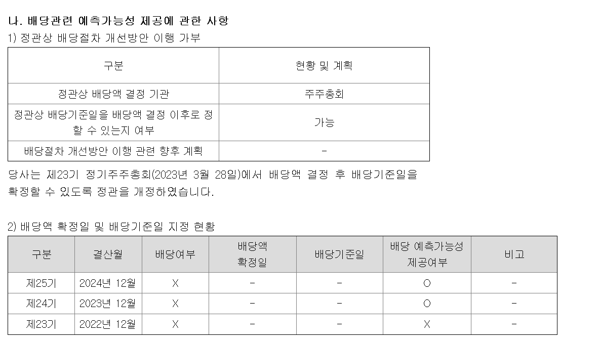
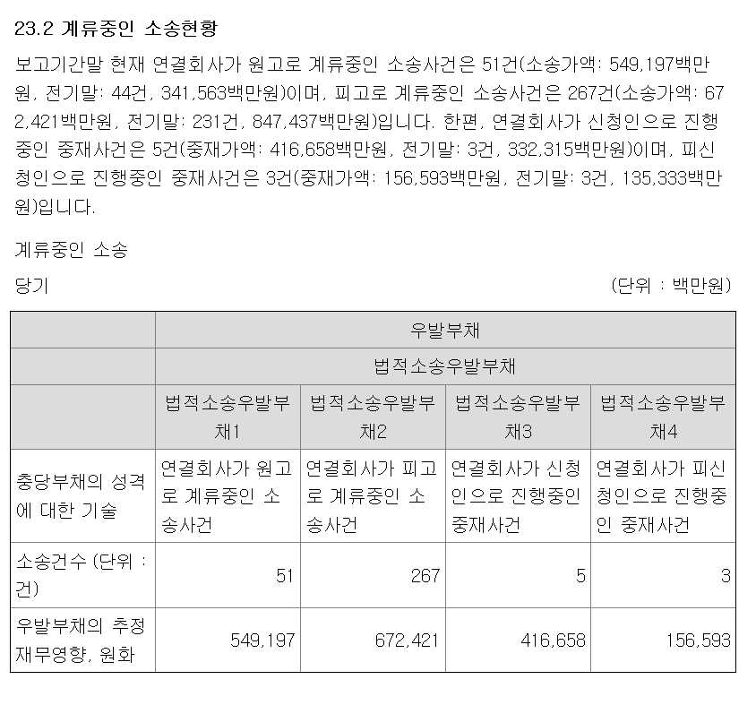
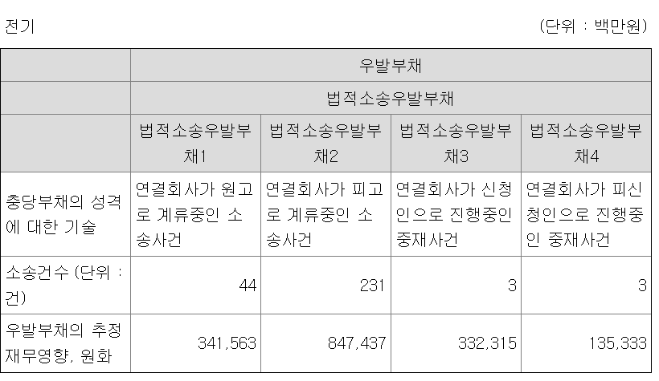

# 대우건설(047040) — 투자 전 Q&A 원문 대조표

- **기준 문서**: 사업보고서 (2025.12), 접수번호 20260318001029, 접수일 2026-03-18
- **보조 문서**: 주요사항보고서(영업정지), 접수번호 20251216000493, 접수일 2025-12-16
- **코퍼스**: `data/corpus` (DART 공시 원문 XML), 절대경로 `/home/dslab/RAGRAG/data/corpus`

---

## Q1. 2025년에 대우건설은 왜 적자로 전환했는가? 어느 사업부문이 손실을 냈는가?

**답변**
2025년 연결 매출액은 8조 546억원으로 전년(10조 5,036억원) 대비 9.8% 감소했고, 영업이익은 전년 4,031억원 흑자에서 ▲8,154억원 적자로, 당기순이익도 전년 2,428억원 흑자에서 ▲9,161억원 적자로 전환했습니다. 3개 핵심 사업부문 중 흑자에서 적자로 실제 **전환**한 곳은 건축·플랜트 2개이고, 토목은 2024년에도 이미 영업손실 상태였던 것이 2025년에 손실 폭이 더 커진 경우입니다.

- **토목** — 매출 1조 4,041억원(전년比 -35.3%), 영업손실 5,919억원(전년에도 영업손실 769억원 → 적자 폭 확대) → 해외 현장 대규모 영업손실 및 국내 항만·개발현장 공정 지연
- **건축** — 매출 5조 5,084억원(전년比 -5.0%), 영업손실 1,843억원(전년 영업이익 2,834억원 → **적자 전환**) → 중도금 대위변제 등 일회성 대손충당금 반영
- **플랜트** — 매출 8,411억원(전년比 -29.7%), 영업손실 1,267억원(전년 영업이익 1,225억원 → **적자 전환**) → 일부 현장 원가율 상승 및 축소 운영

**원문 인용**
> ① 토목사업 
2025년 토목사업본부는 급격한 금리상승 및 시장환경 악화 등 어려운 대외적 경영환경 악화로 매출액은 1조 4,041억원을 기록하였고, 수주는 1조 5,749억원을 기록하였습니다. 해외 현장의 대규모 영업손실 및 국내 항만과 개발현장의 공정 지연으로 매출이 부진하였고. 수주는 국내 SOC 및 기술형입찰 분야에서 호조를 보였으나, 대형 PJ인 가덕도신공항과 이라크 해군기지PJ가 2026년 수주로 이연되었습니다.

>  ②  건축사업
2025년 건축사업본부는 도시정비사업, 공공사업을 중심으로 우수 PJ를 선별하여 11조 625억원의 수주를 달성하였으며, 매출 역시 5조 5,084억원을 기록하였습니다.
2025년 중도금 대위변제 등 일회성 대손충당금 반영으로 인해 1,843억원의 영업손실을 기록하였습니다.

> ③  플랜트사업
일부 현장의 원가율 상승과 축소 운영에 따라 매출액 8,411억원, 영업이익 -1,267억원을 기록하였습니다.

**원문 인용 (표 — 연결 전체 매출액·영업이익·당기순이익의 출처)**
답변 첫 문장의 "8조 546억원 / 영업손실 8,154억원 / 순손실 9,161억원 / 전년 순이익 2,428억원"은 부문별 표가 아니라 바로 위에 있는 연결 손익 요약 표(단위: 원)에서 가져온 값입니다.

| 구분 | 제 26 기(2025) | 제 25 기(2024) | 증감액 | 증감률 |
|---|---|---|---|---|
| 매출액 | 8,054,627,137,857 | 10,503,609,086,034 | (2,448,981,948,177) | -23.32% |
| 영업이익 | (815,431,279,791) | 403,125,613,881 | (1,218,556,893,672) | -302.28% |
| 당기순이익 | (916,079,534,292) | 242,849,735,359 | (1,158,929,269,651) | -477.22% |

직접 검산: (8,054,627,137,857 − 10,503,609,086,034) ÷ 10,503,609,086,034 × 100 = **-23.32%** → 이 표의 증감률은 정상적으로 계산된 값입니다.

**출처**: 사업보고서(2025.12) **Ⅳ.이사의 경영진단 및 분석의견 > 3.재무상태 및 영업실적** (부문별 표 바로 위, 연결 전체 손익 요약 표)
접수번호 20260318001029 (2026-03-18) — https://dart.fss.or.kr/dsaf001/main.do?rcpNo=20260318001029
로컬 경로: `data/corpus/raw/periodic/대우건설/20260318001029_annual_2025_12/20260318001029.xml`

**원문 인용 (표 — "영업손실 5,919억원" 등 손익 숫자의 출처)**
서술문에는 토목사업의 영업손익 숫자가 나오지 않습니다. "영업손실 5,919억원"은 서술문 바로 위에 있는 아래 표(단위: 백만원)에서 가져온 값입니다.

| 구분 |  | 제 26 기(2025) | 제 25 기(2024) | 증감액 | 증감률 |
|---|---|---|---|---|---|
| 토목 | 매출액 | 1,404,097 | 2,170,394 | (766,297) | -35.31% |
|  | 영업손익 | (591,947) | (76,921) | (515,026) | -147.70% |
| 건축 | 매출액 | 5,508,435 | 6,841,821 | (1,333,386) | -5.00% |
|  | 영업손익 | (184,299) | 283,448 | (467,747) | 12.30% |
| 플랜트 | 매출액 | 841,142 | 1,138,621 | (297,479) | -29.70% |
|  | 영업손익 | (126,724) | 122,484 | (249,208) | -26.00% |
| 합계 | 매출액 | 8,054,627 | 10,503,609 | (2,448,982) | -9.80% |
|  | 영업손익 | (815,431) | 403,126 | (1,218,557) | -39.20% |

→ (591,947)백만원 = 5,919억원(반올림), 1,404,097백만원 = 1조 4,041억원(반올림). 표 자체에는 억원 단위 표기가 없고 전부 백만원 단위입니다.

**출처**: 사업보고서(2025.12) **Ⅳ.이사의 경영진단 및 분석의견 > 3.재무상태 및 영업실적** 〈사업부문별 영업실적 분석 및 전망〉 ①토목사업 ②건축사업 ③플랜트사업 서술문 + 바로 위 표
접수번호 20260318001029 (2026-03-18) — https://dart.fss.or.kr/dsaf001/main.do?rcpNo=20260318001029
로컬 경로: `data/corpus/raw/periodic/대우건설/20260318001029_annual_2025_12/20260318001029.xml`

**비교용 원출처 — "제25기(2024)" 열의 1차 출처 (2025년도 제출본, FY2024 사업보고서)**
위 표의 "제25기(2024)" 열은 2025년에 제출된 제25기(FY2024) 사업보고서 원본에도 "당기" 숫자로 그대로 나옵니다. 두 보고서를 나란히 비교해 검증할 수 있도록 원문 표를 그대로 옮깁니다.

| 구분 |  | 제 25 기(2024, 당기) | 제 24 기(2023, 전기) | 증감액 | 증감률 |
|---|---|---|---|---|---|
| 토목 | 매출액 | 2,170,394 | 2,415,121 | (244,727) | -10.1% |
|  | 영업손익 | (76,921) | 161,348 | (238,269) | -147.7% |
| 주택건축 | 매출액 | 6,841,821 | 7,205,130 | (363,309) | -5.0% |
|  | 영업손익 | 283,448 | 252,349 | 31,099 | 12.3% |
| 플랜트 | 매출액 | 1,138,621 | 1,620,194 | (481,573) | -29.7% |
|  | 영업손익 | 122,484 | 165,468 | (42,984) | -26.0% |
| 합계 | 매출액 | 10,503,609 | 11,647,801 | (1,144,192) | -9.8% |
|  | 영업손익 | 403,126 | 662,518 | (259,392) | -39.2% |

→ 토목 2,170,394 / (76,921), 주택건축(=건축) 6,841,821 / 283,448, 플랜트 1,138,621 / 122,484, 합계 10,503,609 / 403,126 — FY2025 보고서 표의 "제25기(2024)" 열과 **모두 일치**함을 직접 대조 확인했습니다. (단, 이 표에서는 "건축"이 "주택건축"으로 표기되는 차이만 있음.)

**출처**: 사업보고서(2024.12, 제25기) **Ⅳ.이사의 경영진단 및 분석의견**(표, 개별 소제목 번호 없이 챕터 직속)
접수번호 20250318000982 (2025-03-18, 최초 제출본) / 이후 20250813000868 (2025-08-13, [기재정정]본 — 이 표는 정정 대상 아님, 두 버전 수치 동일 확인됨)
- https://dart.fss.or.kr/dsaf001/main.do?rcpNo=20250318000982
- https://dart.fss.or.kr/dsaf001/main.do?rcpNo=20250813000868 <이게 최신본> 

---

## Q2. 부채비율이 왜 1년 만에 192.1%에서 284.5%로 급등했는가?

**답변**
2025년 말 부채비율은 284.5%로 전년(192.1%) 대비 92.4%p 상승했습니다. 회사는 사유를 "차입금 증가 등"으로 설명하고 있으며, 같은 기간 유동비율도 211.0% → 194.1%로 하락했습니다. 부채총계는 8조 3,244억원 → 9조 8,839억원으로 늘고, 자본총계는 당기순손실로 인한 이익잉여금 감소 등으로 4조 3,341억원 → 3조 4,746억원으로 줄어, 분모(자본)·분자(부채) 양쪽에서 비율이 악화됐습니다.

**원문 인용 (부채비율 서술문)**
> 당기말 부채비율은 284.5%로 차입금 증가 등으로 전년 말 대비 92.4%p 상승하였습니다.

**출처**: 사업보고서(2025.12) **Ⅳ.이사의 경영진단 및 분석의견 > 4.유동성 및 자금조달과 지출 > 가.유동성에 관한 사항**
접수번호 20260318001029 (2026-03-18) — https://dart.fss.or.kr/dsaf001/main.do?rcpNo=20260318001029
로컬 경로: `data/corpus/raw/periodic/대우건설/20260318001029_annual_2025_12/20260318001029.xml`

**원문 인용 (표 — 부채총계·자본총계 절대금액의 출처)**
"부채총계는 8조 3,244억원 → 9조 8,839억원으로 늘고, 자본총계는 4조 3,341억원 → 3조 4,746억원으로 줄어"의 근거는 부채비율 서술문 바로 앞에 있는 아래 재무상태 요약 표(단위: 원)입니다.

| 구분 | 제 26 기(2025) | 제 25 기(2024) | 증감액 | 증감률 |
|---|---|---|---|---|
| 유동부채 | 5,110,936,916,240 | 4,543,987,487,164 | 566,949,429,076 | 12.48% |
| 비유동부채 | 4,772,960,143,427 | 3,780,376,952,079 | 992,583,191,348 | 26.26% |
| **부채총계** | **9,883,897,059,667** | **8,324,364,439,243** | 1,559,532,620,424 | 18.73% |
| 지배기업소유주지분 | 3,347,692,728,720 | 4,291,145,722,596 | (943,452,993,876) | -21.99% |
| 비지배지분 | 126,912,886,573 | 42,946,104,975 | 83,966,781,598 | 195.52% |
| **자본총계** | **3,474,605,615,293** | **4,334,091,827,571** | (859,486,212,278) | -19.83% |

→ 부채총계 9,883,897,059,667원 = 9조 8,839억원, 8,324,364,439,243원 = 8조 3,244억원(반올림). 자본총계 3,474,605,615,293원 = 3조 4,746억원, 4,334,091,827,571원 = 4조 3,341억원(반올림). 자본총계 감소분(-8,595억원)은 대부분 지배기업소유주지분 감소(-9,435억원, 2025년 순손실로 이익잉여금이 줄어든 영향)에서 비롯되고, 비지배지분은 오히려 840억원 늘었습니다.

**출처**: 사업보고서(2025.12) **Ⅳ.이사의 경영진단 및 분석의견 > 3.재무상태 및 영업실적** (자산·부채·자본 요약 표, 부채비율 서술문 바로 앞)
접수번호 20260318001029 (2026-03-18) — https://dart.fss.or.kr/dsaf001/main.do?rcpNo=20260318001029
로컬 경로: `data/corpus/raw/periodic/대우건설/20260318001029_annual_2025_12/20260318001029.xml`

---

## Q3. 2025년 12월 영업정지 처분은 무슨 사유이고, 사업에 얼마나 영향을 미치는가?

**답변**
대우건설은 2025년 12월 16일 서울시로부터 토목건축공사업 2개월 영업정지 처분을 공고받았으며, 시행일은 2026년 1월 23일입니다. 사유는 건설산업기본법 제82조 제2항 제5호(시공관리 소홀로 인근 공공시설물 파손·공중 피해)이며, 영업정지 대상 매출(7조 6,515억원)은 2024년 연결 매출총액(10조 5,036억원)의 72.84%에 해당합니다. 다만 기존 도급계약·착공 건은 계속 시공 가능하고, 회사는 집행정지 신청 및 처분 취소소송으로 대응할 계획이라고 밝혔습니다.

**원문 인용**

> 영업정지 사유: 건설산업기본법 제82조 제2항 제5호 근거 - 고의나 과실로 시공관리를 소홀히 하여 인근의 주요 공공시설물 등을 파손하여 공중에 피해를 끼친 경우

> 영업정지금액(원) 7,651,504,603,142 / 최근매출총액(원) 10,503,609,086,034 / 매출액 대비(%) 72.84

> 행정처분에 대한 집행정지 신청 및 행정처분 취소소송을 통해 대응할 예정 - 영업정지 행정처분에 대한 집행정지 신청이 받아들여지는 경우, 행정처분 취소소송의 판결시까지 당사의 영업활동에 영향이 없음

> 행정처분을 받기 전 도급계약을 체결하였거나 관련법령에 따라 인허가 등을 득하여 착공한 건설공사의 경우 계속 시공할 수 있음 / 본 영업정지는 서울시 처분사항임.

**출처**: 주요사항보고서(영업정지) 「영업정지」 섹션, 표 1의 4~8번 항목(영업정지사유·향후대책·영업정지영향·영업정지일자·이사회결의일)
접수번호 20251216000493 (2025-12-16, 이사회결의일=공고일) — https://dart.fss.or.kr/dsaf001/main.do?rcpNo=20251216000493
로컬 경로: `data/corpus/raw/major/대우건설/20251216000493/20251216000493.xml`
> 이 문서는 챕터 구분 없는 단일 서식(표 1개)입니다 — DART 뷰어에서 문서 전체가 한 화면에 보입니다.

---

## Q4. 대우건설은 배당을 주는 회사인가? 최근 3년 배당 이력은?

**답변**
제24기(2023)~제26기(2025) 3개년 연속 결산배당 없음입니다(현금·주식배당금총액, 주당배당금 모두 "-"). 배당정책은 "이익의 일정부분을 주주에게 환원"하되 주주가치 제고·성장투자·경영실적·현금흐름을 종합적으로 고려해 결정한다는 원론적 문구뿐이며, 확정된 배당 계획은 없습니다. 대신 2026년 3월 4일 이사회는 기취득 자기주식 4,715,000주의 소각을 결정해, 배당이 아닌 자사주 소각으로 주주환원을 대체하고 있습니다.

**원문 인용 (배당정책·배당이력)**
> 당사는 이익의 일정부분을 주주에게 환원하는 배당을 중요하게 생각하고 있습니다. 향후 배당 여부는 주주가치 제고, 성장을 위한 투자, 경영실적 및 현금흐름 상황 등을 전반적으로 고려하여 결정할 것입니다.

> 결산배당 / 2025년 12월 배당여부 X · 2024년 12월 배당여부 X · 2023년 12월 배당여부 X

**출처**: 사업보고서(2025.12) **Ⅲ.재무에 관한 사항 > 6.배당에 관한 사항 > 가.회사의 배당정책에 관한 사항 / 나.배당관련 예측가능성 제공에 관한 사항 (2)배당액 확정일 및 배당기준일 지정 현황**
접수번호 20260318001029 (2026-03-18) — https://dart.fss.or.kr/dsaf001/main.do?rcpNo=20260318001029
로컬 경로: `data/corpus/raw/periodic/대우건설/20260318001029_annual_2025_12/20260318001029.xml`

**원문 인용 (자기주식 소각 — 별개 위치)**
> 당사는 2026년 3월 4일 이사회 결의에 따라 보유중인 자기주식 4,715,000주를소각하기로 결정했습니다.

*(원문 그대로: "주를"과 "소각" 사이 띄어쓰기 없음)*

**출처**: 사업보고서(2025.12) **Ⅲ.재무에 관한 사항 > 5.재무제표 주석 > 38.보고기간 후 사건** (표 내 "자기주식소각_1" 행)
접수번호 20260318001029 (2026-03-18) — https://dart.fss.or.kr/dsaf001/main.do?rcpNo=20260318001029
로컬 경로: `data/corpus/raw/periodic/대우건설/20260318001029_annual_2025_12/20260318001029.xml`
> 배당 항목과는 완전히 다른 섹션(38.보고기간 후 사건)입니다. 동일 문장이 연결기준(38.보고기간 후 사건(연결), "연결회사는…")과 별도기준(38.보고기간 후 사건, "당사는…") 두 곳에 중복 게재되어 있습니다.

---

## Q5. 최대주주는 누구이고 지분율은? 경영권은 안정적인가?

**답변 (문서에서 직접 확인된 사실만)**
최대주주는 중흥토건㈜로 지분율 40.60%입니다. 2022년 2월 28일 종전 최대주주였던 케이디비인베스트먼트제일호유한회사로부터 현재 최대주주로 변경되었습니다. 2023년에는 정원주 중흥그룹 부회장이 대우건설 회장으로 취임했습니다.

**원문 인용 (최대주주 변경 이력)**
> 현재 당사의 최대주주는 '중흥토건㈜' 입니다. 2022년 2월 28일부로 종전 최대주주인 '케이디비인베스트먼트제일호유한회사' 에서 현재의 최대주주로 변동되었습니다.

**출처**: 사업보고서(2025.12) **Ⅰ.회사의 개요 > 2.회사의 연혁 > 다.최대주주의 변동**
접수번호 20260318001029 (2026-03-18) — https://dart.fss.or.kr/dsaf001/main.do?rcpNo=20260318001029
로컬 경로: `data/corpus/raw/periodic/대우건설/20260318001029_annual_2025_12/20260318001029.xml`

**원문 인용 (지분율 40.60% — 별개 위치)**
> 보고기간말 현재 연결회사의 납입자본금은 2,078,113백만원이며, 최대주주는 중흥토건(주)(40.60%)입니다.

**출처**: 사업보고서(2025.12) **Ⅲ.재무에 관한 사항 > 3.연결재무제표 주석 > 1.일반사항 (연결)**
접수번호 20260318001029 (2026-03-18) — https://dart.fss.or.kr/dsaf001/main.do?rcpNo=20260318001029
로컬 경로: `data/corpus/raw/periodic/대우건설/20260318001029_annual_2025_12/20260318001029.xml`
> 위 두 인용문은 서로 다른 챕터(Ⅰ장 vs Ⅲ장)에 있는 별개 서술입니다.

**원문 인용 (2023년 정원주 회장 취임 — 연혁 표)**
> 2023. 정원주 중흥그룹 부회장, 대우건설 회장 취임

**출처**: 사업보고서(2025.12) **Ⅰ.회사의 개요 > 2.회사의 연혁** (아. 그 밖에 경영활동과 관련된 중요한 사항의 발생내용 〈표 2〉, "㈜대우건설" 행 연표)
접수번호 20260318001029 (2026-03-18) — https://dart.fss.or.kr/dsaf001/main.do?rcpNo=20260318001029
로컬 경로: `data/corpus/raw/periodic/대우건설/20260318001029_annual_2025_12/20260318001029.xml`

---

## Q6. 계류 중인 소송·중재 규모는 얼마나 크며, 재무상태에 부담이 될 수준인가?

**답변**
2025년 말 기준 연결회사가 원고인 소송은 73건(소송가액 6,088억원, 전기 51건·5,492억원), 피고인 소송은 288건(소송가액 7,623억원, 전기 267건·6,724억원)으로 건수·금액 모두 전년 대비 증가했습니다. 중재사건은 신청인 8건(5,058억원), 피신청인 6건(2,252억원)입니다.

**원문 인용**
> 보고기간말 현재 연결회사가 원고로 계류중인 소송사건은 73건(소송가액: 608,763백만원, 전기말: 51건, 549,197백만원)이며, 피고로 계류중인 소송사건은 288건(소송가액: 762,253백만원, 전기말: 267건, 672,421백만원)입니다. 한편, 연결회사가 신청인으로 진행중인 중재사건은 8건(중재가액: 505,750백만원, 전기말: 5건, 416,658백만원)이며, 피신청인으로 진행중인 중재사건은 6건(중재가액: 225,196백만원, 전기말: 3건, 156,593백만원)입니다.

**출처**: 사업보고서(2025.12) **Ⅲ.재무에 관한 사항 > 3.연결재무제표 주석 > 23.우발상황 및 약정사항(연결) > 23.2 계류중인 소송현황**
접수번호 20260318001029 (2026-03-18) — https://dart.fss.or.kr/dsaf001/main.do?rcpNo=20260318001029
로컬 경로: `data/corpus/raw/periodic/대우건설/20260318001029_annual_2025_12/20260318001029.xml`
> 참고: 동일 문단이 **Ⅺ.그 밖에 투자자 보호를 위하여 필요한 사항 > 2.우발부채 등에 관한 사항**에도 그대로 중복 게재되어 있습니다. 키워드 검색 시 두 위치 중 아무 곳이나 걸릴 수 있습니다.

---

## Q7. 2026년 이후 성장 모멘텀은 무엇인가? 이연된 수주 건이 있는가?

**답변**
토목부문은 대형 프로젝트인 가덕도신공항과 이라크 해군기지 PJ 수주가 2026년으로 이연되었고, 여기에 용인첨단산업단지(기술형 입찰) 및 위례-과천광역철도(대형 SOC)를 추가로 추진 중입니다. 건축부문은 2025년 18,834세대를 공급해 2년 연속 국내 주택공급 1위를 유지했습니다. 플랜트부문은 1조원 규모 투르크메니스탄 미네랄 비료 프로젝트를 수주했고, 핵연료·SMR·원전 해체 등 차세대 원자력 신사업을 지속 추진 중입니다.

**원문 인용**
> 대형 PJ인 가덕도신공항과 이라크 해군기지PJ가 2026년 수주로 이연되었습니다. 하지만 2026년에는 이연되 2개 PJ외 용인첨단산업단지와 같은 기술형 입찰PJ와 위례-과천광역철도와 같은 대형 SOC 사업의 수주를 추진하여

> 분양성이 양호한 수도권을 중심으로 전국적으로 18,834세대를 공급하여 2년 연속 국내 주택공급 1위를 달성하여

> 당사가 시공사로 참여한 팀코리아와 발주처 간 본계약 체결과 1조 원 규모의 투르크메니스탄 미네랄 비료 프로젝트 수주 등 해외시장을 중심으로 의미 있는 성과를 거두었습니다.

> 핵연료, SMR, 원전 해체사업 등 차세대 원자력 신사업 분야도 지속적으로 사업화를 추진하며 원자력 전 분야 시장 선도 위치를 굳건히 하고자 합니다.

**출처**: 사업보고서(2025.12) **Ⅳ.이사의 경영진단 및 분석의견 > 3.재무상태 및 영업실적** 〈사업부문별 영업실적 분석 및 전망〉 ①토목 ②건축 ③플랜트
접수번호 20260318001029 (2026-03-18) — https://dart.fss.or.kr/dsaf001/main.do?rcpNo=20260318001029
로컬 경로: `data/corpus/raw/periodic/대우건설/20260318001029_annual_2025_12/20260318001029.xml`
> Q1과 동일 섹션입니다.
